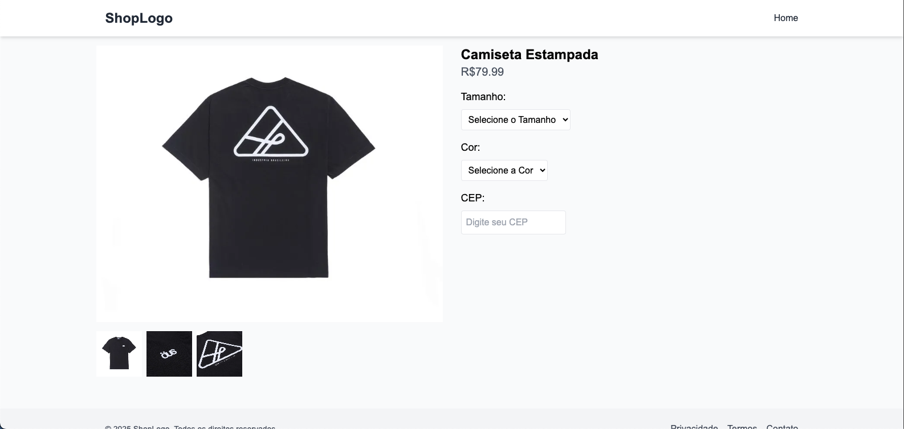
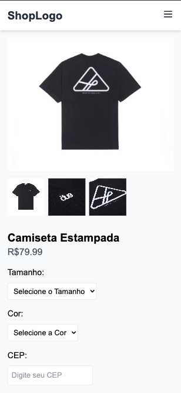

# React + TypeScript + Vite – E-commerce Product Page

This project is a modern React + TypeScript single-page application built with Vite that showcases a **product details page** for an online store. It focuses on fast UX, strong type safety, and good accessibility and DX (developer experience).

---

## What this project does

- Displays a **product detail page** with:
  - Main product image and clickable thumbnails
  - Title, price, available sizes and colors
  - Stored user selections (size/color) in local storage
- Lets the user **check shipping information by CEP (Brazilian ZIP code)**:
  - Validates CEP input
  - Calls the ViaCEP API to resolve the address
  - Shows loading and error states

---

## Problems it solves

- Provides a **realistic product detail experience** for a Brazilian e-commerce scenario (sizes, colors, CEP freight/address lookup).
- Centralizes all HTTP logic in a **single, configurable API client**, avoiding duplicated Axios instances scattered in components and loaders.
- Uses **React Router's data APIs** so that:
  - The same API client is available in loaders/actions and components.
  - You can evolve to data-driven routing (loaders, actions, errorElement) without changing how you call the backend.
- Enforces **accessibility and good practices** (labels, keyboard events, button types, alt text, etc.) via linting.

---

## Main technologies and architecture

### Core stack

- **React 19 + TypeScript**
- **Vite** (dev server + build)
- **React Router DOM (createBrowserRouter)** for routing and data APIs
- **Axios** for HTTP requests, wrapped by a custom `APIClient` class
- **Tailwind CSS** for styling
- **Yarn** as package manager
- **Biome** for linting and formatting

---

## Routing and error handling

The application uses `createBrowserRouter` with:

- A **`Root` layout route**:
  - Contains the main page structure (navbar, footer, layout container).
  - Uses `<Outlet>` to render child routes.
  - Passes shared data (like `apiClient`) through `Outlet` context.
- A **`Home` page**:
  - Renders `Navbar`, `Product`, and `Footer`.
- A global **`ErrorBoundary`**:
  - Configured as `errorElement` in the router.
  - Displays a friendly error UI when a route loader/action or component throws.
  - Includes options like "Go back home" and "Reload page".

---

## Shared API client via Router context

The project defines a strongly-typed `APIClient` class that wraps Axios and exposes generic HTTP methods:

- `get<T>()`
- `post<T, D>()`
- `put<T, D>()`
- `patch<T, D>()`
- `delete<T>()`

**Key features**:

- Reads base URL from `VITE_API_URL`
- JWT token injection via request interceptor
- Global error handling (401 → logout)
- Single instance shared across loaders/actions/components

Using React Router's `getContext` + `RouterContextProvider`:

- **Loaders/Actions**: `context.get(apiClientContext)`
- **Components**: `useOutletContext().apiClient`

---

## Custom hooks and product page behavior

### `useAddress` hook

Encapsulates CEP lookup logic:

- `address: string`
- `loading: boolean`
- `error: string | null`
- `fetchAddress(cep: string)`

Calls ViaCEP API and handles loading/error states.

### `Product` component

Manages:

- Image gallery with keyboard-accessible thumbnails
- Persistent size/color selection (`useLocalStorage`)
- Real-time CEP → address lookup

---

## Accessibility features

✅ **Labels properly associated** with inputs/selects (`htmlFor` + `id`)
✅ **Buttons have explicit `type="button"`**
✅ **SVGs have accessible titles** or `aria-hidden="true"`
✅ **Clickable elements support keyboard** (Enter/Space)
✅ **Stable keys** in mapped lists (`key={size}` instead of `key={index}`)

---

## Project scripts

```bash
# Install dependencies
yarn install

# Start development server
yarn dev

# Build for production
yarn build

# Preview production build
yarn preview

# Lint & format
yarn lint
```

## Template





## Architecture benefits

| Feature      | Without Router Context     | With Router Context              |
| ------------ | -------------------------- | -------------------------------- |
| API Client   | Duplicated axios instances | ✅ Single shared instance        |
| Token sync   | Manual token passing       | ✅ Auto-injected via interceptor |
| Testing      | Hard to mock               | ✅ Easy to mock in tests         |
| Type safety  | Manual typing              | ✅ Full TypeScript support       |
| Data loading | Component-only             | ✅ Loaders + Components          |
